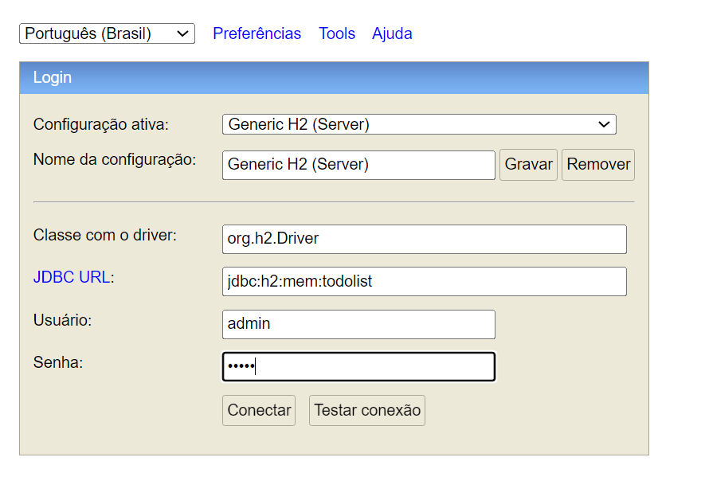
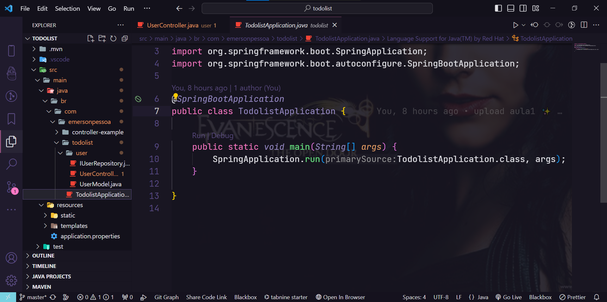

<p align="center">
  <a href="https://www.notion.so/Curso-de-Java-d4a7859f8ad74147bfeb44ed787031d8" rel="nofollow noopener noreferrer" target="_blank"></a>
</p>

<h1 align="center"> Rocketseat <a href="https://www.notion.so/Curso-de-Java-d4a7859f8ad74147bfeb44ed787031d8" rel="nofollow noopener noreferrer" alt="Material complementar" target="_blank"></a> To-Do List </h1>

## Curso online de Java da Rocketseat
### Tópicos 

:small_blue_diamond:[Material Complementar](#material-complementar)

:small_blue_diamond:[Dependências](#dependências)

:small_blue_diamond:[Acesso ao Banco de Dados](#acesso-ao-banco-de-dados)

:small_blue_diamond:[Estrutura do projeto](#estrutura-do-projeto)

:small_blue_diamond:[Configuração do application properties](#Configuração-do-application-properties)
<br><br>

Aulas|Descrição
|----|----|
&#10004; Aula01| Construção back-end de uma aplicação de To-Do List.
&#10004; Aula02 | Integração com Banco de Dados utilizando o H2 Database.
&#10004; Aula03| Implementando segurança nos dados do usuário.
&#10004; Aula04| Atualizando tarefas e validação de rotas, utilizando Apidog como testador de API .

## Material Complementar

[Curso online Java](https://www.notion.so/Curso-de-Java-d4a7859f8ad74147bfeb44ed787031d8)

## Dependências:

&#10003; Lombok

        <dependency>
            <groupId>org.projectlombok</groupId>
            <artifactId>lombok</artifactId>
            <version>1.18.30</version>
            <scope>provided</scope>
        </dependency>

&#10003; h2 Database Engine

        <dependency>
            <groupId>org.springframework.boot</groupId>
            <artifactId>spring-boot-starter-data-jpa</artifactId>
        </dependency>
        <dependency>
            <groupId>com.h2database</groupId>
            <artifactId>h2</artifactId>
            <scope>runtime</scope>
        </dependency>


&#10003; bcrypt

        <dependency>
            <groupId>at.favre.lib</groupId>
            <artifactId>bcrypt</artifactId>
            <version>0.10.2</version>
        </dependency>


## Configuração do application properties

~~~
    spring.datasource.url=jdbc:h2:mem:todolist
    spring.datasource.driverClassName=org.h2.Driver
    spring.datasource.username=admin
    spring.datasource.password=admin
    spring.jpa.database-platform=org.hibernate.dialect.H2Dialect
    spring.h2.console.enabled=true
~~~

## Acesso ao Banco de Dados

* Digitar no campo de endereço do navegador: <br>

```
localhost:8080/h2-console
```
<br>


* trocar o endereço do <strong>JDBC URL</strong> para:<br>

```
jdbc:h2:mem:todolist 
```
<br>

<div align="left"></div>

## Estrutura do projeto

<div align="center"></div>
