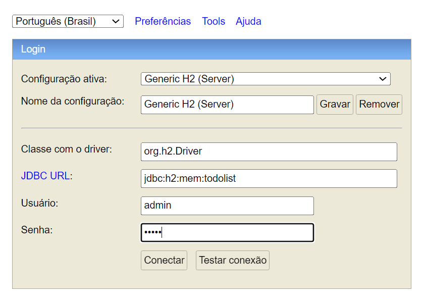
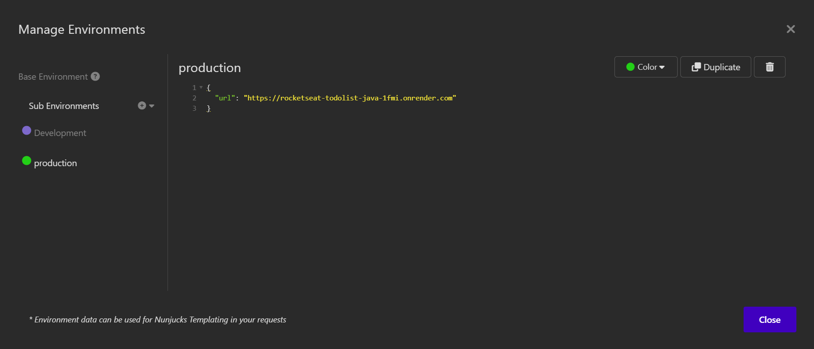
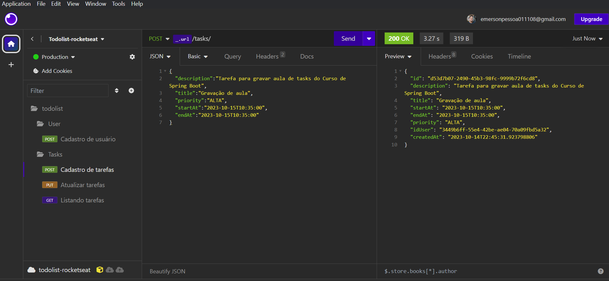
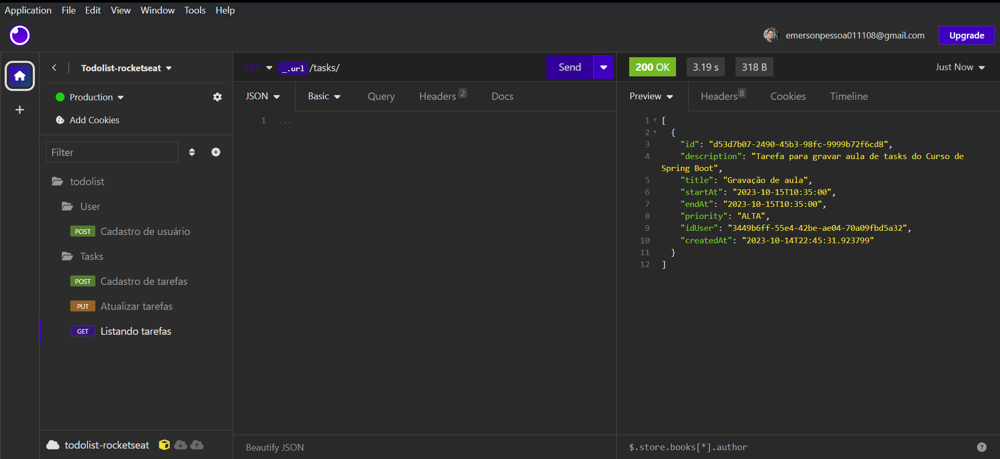
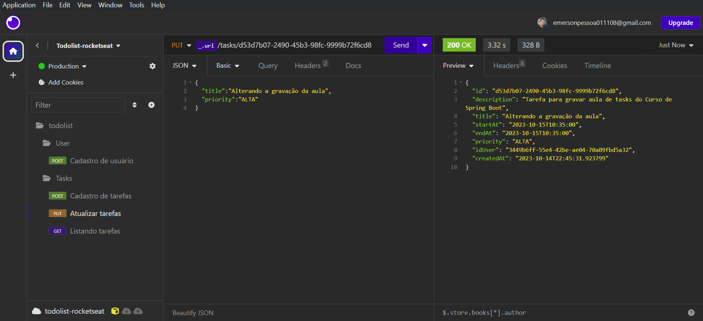
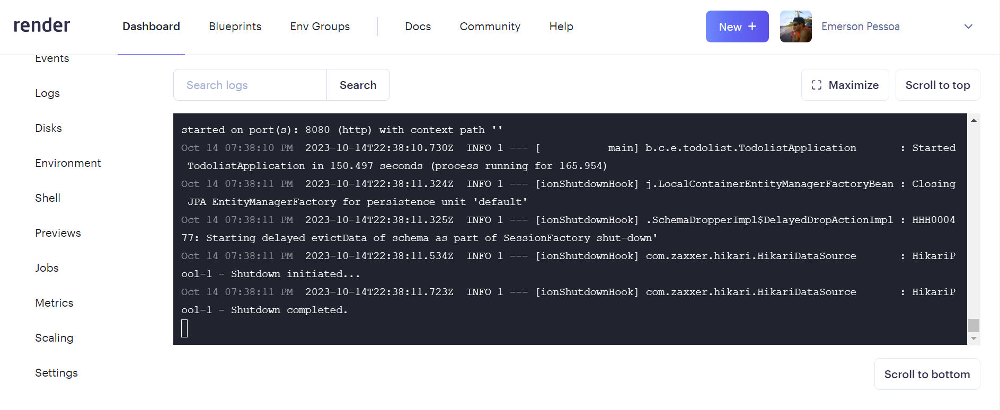

<p align="center">
  <a href="https://www.notion.so/Curso-de-Java-d4a7859f8ad74147bfeb44ed787031d8" rel="nofollow noopener noreferrer" target="_blank"></a>
</p>

<h1 align="center">To-Do List <a href="https://www.notion.so/Curso-de-Java-d4a7859f8ad74147bfeb44ed787031d8" rel="nofollow noopener noreferrer" alt="Material complementar" target="_blank"></a> </h1>

## Curso online de Java da Rocketseat

### Tópicos

:small_blue_diamond:[Material Complementar](#material-complementar)

:small_blue_diamond:[Dependências](#dependências)

:small_blue_diamond:[Acesso ao Banco de Dados](#acesso-ao-banco-de-dados)

:small_blue_diamond:[Configuração do application properties](#Configuração-do-application-properties)

:small_blue_diamond:[Cadastro Deploy](#cadastro-deploy)

:small_blue_diamond:[API Deploy](#api-deploy)

:small_blue_diamond:[Path de requisição](#path-de-requisição)

:small_blue_diamond:[Estrutura do projeto](#estrutura-do-projeto)

<br><br>

| Aulas           | Descrição                                                                         |
| --------------- | --------------------------------------------------------------------------------- |
| &#10004; Aula01 | Construção back-end de uma aplicação de To-Do List.                               |
| &#10004; Aula02 | Integração com Banco de Dados utilizando o H2 Database.                           |
| &#10004; Aula03 | Implementando segurança nos dados do usuário.                                     |
| &#10004; Aula04 | Atualizando tarefas e validação de rotas, utilizando Apidog como testador de API. |
| &#10004; Aula05 | Deploy do Back-End.                                                               |

## Material Complementar

[Curso online Java](https://www.notion.so/Curso-de-Java-d4a7859f8ad74147bfeb44ed787031d8)

## Dependências:

&#10003; Lombok &nbsp;&nbsp;&nbsp;[Segue o link](https://projectlombok.org/setup/maven)

        <dependency>
            <groupId>org.projectlombok</groupId>
            <artifactId>lombok</artifactId>
            <version>1.18.30</version>
            <scope>provided</scope>
        </dependency>

&#10003; h2 Database Engine &nbsp;&nbsp;&nbsp;[Segue o link](https://www.baeldung.com/spring-boot-h2-database)

        <dependency>
            <groupId>org.springframework.boot</groupId>
            <artifactId>spring-boot-starter-data-jpa</artifactId>
        </dependency>
        <dependency>
            <groupId>com.h2database</groupId>
            <artifactId>h2</artifactId>
            <scope>runtime</scope>
        </dependency>

&#10003; bcrypt &nbsp;&nbsp;&nbsp;[Segue o link](https://github.com/patrickfav/bcrypt)

        <dependency>
            <groupId>at.favre.lib</groupId>
            <artifactId>bcrypt</artifactId>
            <version>0.10.2</version>
        </dependency>

&#10003; Developer Tools &nbsp;&nbsp;&nbsp;[Segue o link](https://docs.spring.io/spring-boot/docs/1.5.16.RELEASE/reference/html/using-boot-devtools.html)

        <dependency>
            <groupId>org.springframework.boot</groupId>
            <artifactId>spring-boot-devtools</artifactId>
            <optional>true</optional>
        </dependency>

Startar o servidor:
```
$ mvn spring-boot:run
```

## Configuração do application properties

```
    spring.datasource.url=jdbc:h2:mem:todolist
    spring.datasource.driverClassName=org.h2.Driver
    spring.datasource.username=admin
    spring.datasource.password=admin
    spring.jpa.database-platform=org.hibernate.dialect.H2Dialect
    spring.h2.console.enabled=true
```

## Acesso ao Banco de Dados

-   Digitar no campo de endereço do navegador: <br>

```
localhost:8080/h2-console
```

<br>

-   trocar o endereço do <strong>JDBC URL</strong> para:<br>

```
jdbc:h2:mem:todolist
```

<br>

<div align="center"></div>

## Cadastro Deploy
[render.com](https://render.com/)

<br>

## API Deploy
[todolist](https://rocketseat-todolist-java-1fmi.onrender.com)

<br>

## Path de requisição

&#10003; Cadastro de usuários
```
https://rocketseat-todolist-java-1fmi.onrender.com/users
```
&#10003; Cadastro de tarefas
```
https://rocketseat-todolist-java-1fmi.onrender.com/tasks
```
&#10003; Listando tarefas
```
https://rocketseat-todolist-java-1fmi.onrender.com/tasks
```
&#10003; Atualizando tarefas
```
https://rocketseat-todolist-java-1fmi.onrender.com/id
```
<br>

## Estrutura do projeto

<div></div><br>
<div></div><br>
<div></div><br>
<div></div><br>
<div></div><br>
<div></div>

