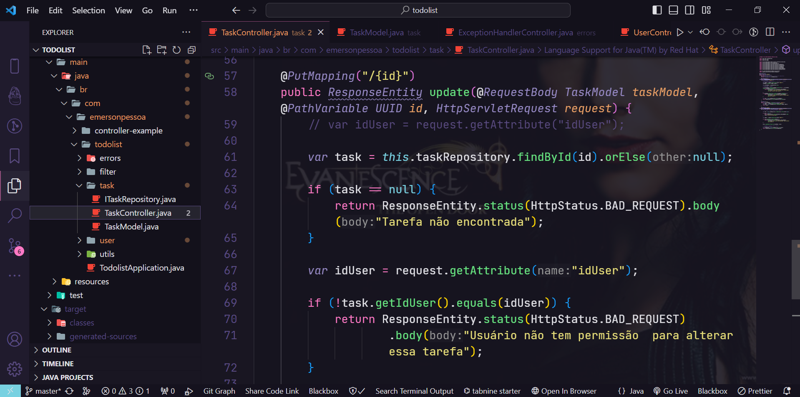

  

 Rocketseat  To-Do List 

---

### Semana online de Java da Rocketseat utilizando o framework Springboot configurado no VSCODE.

Aulas | Descrição
:----:  | :----
&#10004; Aula01| Construção do backend de uma aplicação To-Do List.
&#10004;  Aula02 | Integração com o Banco de Dados utilizando o H2 Database.
&#10004; Aula03| Implementando segurança nos dados do usuário.
&#10004; Aula04| Atualizando tarefas e validação de rotas,utilizando o testador de API Apidog.

### Dependências:

<!-- lombok -->
&#10003; Lombok

        <dependency>
            <groupId>org.projectlombok</groupId>
            <artifactId>lombok</artifactId>
            <version>1.18.30</version>
            <scope>provided</scope>
        </dependency>

&#10003; h2 Database Engine
<!-- h2 Database Engine  -->

        <dependency>
            <groupId>org.springframework.boot</groupId>
            <artifactId>spring-boot-starter-data-jpa</artifactId>
        </dependency>
        <dependency>
            <groupId>com.h2database</groupId>
            <artifactId>h2</artifactId>
            <scope>runtime</scope>
        </dependency>

        
&#10003; bcrypt

        <dependency>
            <groupId>at.favre.lib</groupId>
            <artifactId>bcrypt</artifactId>
            <version>0.10.2</version>
        </dependency>

&#10003; `application.properties`
~~~
    spring.datasource.url=jdbc:h2:mem:todolist
    spring.datasource.driverClassName=org.h2.Driver
    spring.datasource.username=admin
    spring.datasource.password=admin
    spring.jpa.database-platform=org.hibernate.dialect.H2Dialect
    spring.h2.console.enabled=true
~~~

######  _PARA ACESSAR O BANCO DE DADOS EM MEMÓRIA_
`localhost:8080/h2-console` 
`trocar A URL do JDBC para jdbc:h2:mem:todolist`
## Estrutura do projeto:

<!--  -->

